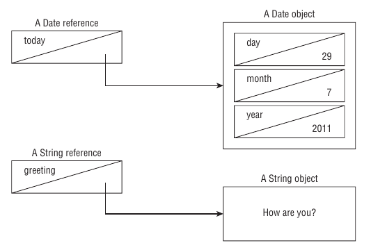

# Java building blocks

---

## Constructors

Is a special method to create objects. Its **name must match the class name** and **doesn't have return type**.
If the class doesn't have a constructor, Java will provide a *do nothing* constructor. It is called **default constructor** and doesn't receive any parameters.
Any time you use a constructor the `new` keyword is required.

```java
public class Chick {
    private final String name;

    // Constructor method
    public Chick(String name) {
        System.out.println("This is a simple constructor");
        this.name = name;
    }
}
```

## Order of initialization

1. Fields and instance initializer blicks are run in the order in which they appear in the file
2. The constructor runs after all fields and instance initializer blocks have run
3. **Anonymous block and constructor are called every time you instanciate a class**
4. Order matters in fields and anonymous blocks. You cannot refer to a variable before it is declared

```java
public class Chick {
    private String name = "Fluffy";

    {
        System.out.println("Anonymous block: " + this.name);
    }

    public Chick(String name) {
        System.out.println("Constructor");
        this.name = name;
    }

    public static void main(String[] args) {
        Chick chick = new Chick("Tiny");
        System.out.println(chick.name);
    }
}
```

> Anonymous block: Fluffy
> Constructor
> Tiny

## Primitive types

* boolean: true or false
* byte: 8-bit integral value
* short: 16-bit integral value
* int: 32-bit integral value
* long: 64-bit integral value
* float: 32-bit floating-point value
* double: 64-bit floating-point value
* char: 16-bit Unicode value

By default, any hardcoded number is an `int`.
Octal numbers can be defined using a `0` as prefix. E.g. `017`
Hexadecimal numbers are defined using the `0x` and `0X`prefixes. E.g. `0xFF`, `0xff`, `0XFf`
Binary numbers are defined using the `0b` and `0B` prefixes. E.g. `0b10` or `0B10`

## Literals using the underscore character

You can write numbers using the underscore character. However, it has some considerations

```java
double notArStart = _1000.00;          // Does not compile
double notAtTheEnd = 1000.00_;         // Does not compile
double notBeforeDecimal = 1000_.00;    // Does not compile
double notAfterDecimal = 1000._00;     // Does not compile
double annoyingButLegal = 1_00_0.0_0;  // Ugly, but compiles
double reallyUgly = 1__________2;      // Also compiles
```

## Reference types and primitives



When you create a new object the variable does not contain the object itself. Instead, it contains a reference pointing to real object. If multiple variables point to the same object in memory and that object is modified, that change will be reflected in the other variables.

When you use **a primitive type**, it **cannot be assigned to a null value**. This happens because a primitive is not a reference.

## Rules for identifier names

* Must begin with a `letter`, `$` or `_`
* Can include `numbers` but no start with them
* **Since 9, `_` is not allowed as identifier**
* You cannot use Java reserved words as identifiers

## Multiple variable declaration

```java
// Each variable has a value assigned
jshell> String y = "yes", n = "no";
y ==> "yes"
n ==> "no"

// Only the last variable is initialized
jshell> Integer a, b, c = 1;
a ==> null
b ==> null
c ==> 1

// n is not initialized
jshell> String y = "yes", n, u = "unknown";
y ==> "yes"
n ==> null
u ==> "unknown"

jshell> int n, String y; // Does not compile
```

## `var` keyword

* Technical name is `local variable type inference`. This means it is only valid in local contexts.
* Declaration and initialization **must** happen in the same line.
* Once the variable type in defined, you cannot change it.
* You can only declare `var` variable per line
* `var` cannot be initialized to `null`. However, you can assign null to a `var` after initialization.
* **Naming a local variable as `var` is legal**... for some stupid reason. It isn't a reserved word, but a `reserved type name`. So, that name cannot be used to define a type, such has class names, interfaces or enums.

```java
var a, b, c; // Does not compile. Multiple variable declarations in one single line are not allowed

// Does not compile. Declaration and initialization is not in the same line
var a;
a = 'a';

// Does not compile. Once the type is defined, it cannot be changed
var a = 'a';
a = 1.0;

var a = null; // Does not compile. null cannot be mapped to a Java type

var a = "foo"; // Infered type is String
a = null;      // And can be assigned to null

var a = (String) null; // Also compiles since the type (String) can be infered from the cast

var var = "It works... somehow";
```
