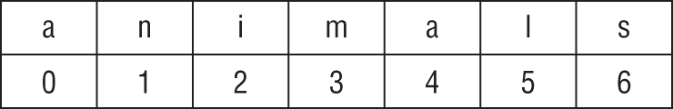

# [Core Java APIs](https://docs.oracle.com/en/java/javase/11/docs/api/index.html)

## Creating and manipulating Strings

[String](https://docs.oracle.com/en/java/javase/11/docs/api/java.base/java/lang/String.html) class implements [CharSequence](https://docs.oracle.com/en/java/javase/11/docs/api/java.base/java/lang/CharSequence.html). Is such a fundamental class that the `new` keyword is not required when creating a `String`.

```java
String name = "Fluffy";             // Uses String pool
String name = new String("Fluffy"); // Does not uses String pool
```

## Concatenation

In Java, the `+` operator is *overloaded*. It can be used for aritmethic addition or String concatenation.

1. If both operands are numeric, `+` means numeric addition.
1. If either operand is a String, `+` means concatenation.
1. The expression is evaluated **left to right**.

```java
System.out.println(1 + 2);           // 3
System.out.println("a" + "b");       // ab
System.out.println("a" + "b" + 3);   // ab3
System.out.println(1 + 2 + "c");     // 3c
System.out.println("c" + 1 + 2);     // c12

// A more complicaded example
int three = 3;
String four = "4";
System.out.println(1 + 2 + three + four);

// Compound += operator can be used in Strings
String s = "1";             // s currently holds "1"
s += "2";                   // s currently holds "12"
s += 3;                     // s currently holds "123"
System.out.println(s);      // 123
```

## Inmutability

Once you create a `String`, it is not allowed to change. For this reason, many of the `String` that return another `String` does not modify the original `String`. Instead, those methods return a new `String`

```java
String s1 = "1";
String s2 = s1.concat("2");
s2.concat("3");

System.out.println(s2);

// Another example
String a = "abc";
String b = a.toUpperCase();
b = b.replace("B", "2").replace('C', '3');

System.out.println("a = " + a); // a = abc
System.out.println("b = " + b); // b = A23
```

## Important String methods

Before we go further, you need to understand how a String is indexed.



### [length()](https://docs.oracle.com/en/java/javase/11/docs/api/java.base/java/lang/String.html#length())

Returns the length of this string. The length is equal to the number of Unicode code units in the string.

```java
String string = "animals";
System.out.println(string.length());  // 7
```

### [chartAt()](https://docs.oracle.com/en/java/javase/11/docs/api/java.base/java/lang/String.html#charAt(int))

Returns the char value at the specified index. An index ranges from 0 to length() - 1. The first char value of the sequence is at index 0, the next at index 1, and so on, as for array indexing.

If the specified index is out of the String boundaries, a [StringIndexOutOfBoundsException](https://docs.oracle.com/en/java/javase/11/docs/api/java.base/java/lang/StringIndexOutOfBoundsException.html) is thrown.

```java
String string = "animals";
System.out.println(string.charAt(0));  // a
System.out.println(string.charAt(6));  // s

System.out.println(string.charAt(-1)); // throws exception
System.out.println(string.charAt(7));  // throws exception
```

### indexOf()

Looks at the characters in the string and finds the first index that matches the desired value.

* [int indexOf(int ch)](https://docs.oracle.com/en/java/javase/11/docs/api/java.base/java/lang/String.html#indexOf(int))
* [int indexOf(String str)](https://docs.oracle.com/en/java/javase/11/docs/api/java.base/java/lang/String.html#indexOf(java.lang.String))
* [int indexOf(int ch, int fromIndex)](https://docs.oracle.com/en/java/javase/11/docs/api/java.base/java/lang/String.html#indexOf(int,int))
* [int indexOf(String str, int fromIndex)](https://docs.oracle.com/en/java/javase/11/docs/api/java.base/java/lang/String.html#indexOf(java.lang.String,int))

```java
String string = "animals";

System.out.println(string.indexOf('a'));         // 0
System.out.println(string.indexOf("al"));        // 4
System.out.println(string.indexOf('a', 4));      // 4
System.out.println(string.indexOf("al", 5));     // -1
```

### substring()

Returns parts of the `String`.

`beginIndex` is **inclusive**
`endIndex` is **exclusive**

* [String substring(int beginIndex)](https://docs.oracle.com/en/java/javase/11/docs/api/java.base/java/lang/String.html#substring(int))
* [String substring(int beginIndex, int endIndex)](https://docs.oracle.com/en/java/javase/11/docs/api/java.base/java/lang/String.html#substring(int,int))

```java
String string = "animals";

System.out.println(string.substring(3));                   // mals
System.out.println(string.substring(string.indexOf('m'))); // mals
System.out.println(string.substring(3, 4));                // m
System.out.println(string.substring(3, 7));                // mals

// substring() special cases
System.out.println(string.substring(3, 3)); // empty string
System.out.println(string.substring(3, 2)); // throws StringIndexOutOfBoundsException
System.out.println(string.substring(3, 8)); // throws StringIndexOutOfBoundsException
```

### [toLowerCase()](https://docs.oracle.com/en/java/javase/11/docs/api/java.base/java/lang/String.html#toLowerCase())

Returns a String in lower case.

```java
String string = "ANIMALS";
System.out.println(string.toLowerCase());  // animals
```

### [toUpperCase()](https://docs.oracle.com/en/java/javase/11/docs/api/java.base/java/lang/String.html#toUpperCase())

```java
String string = "animals";
System.out.println(string.toUpperCase());  // ANIMALS
```

### [equals()](https://docs.oracle.com/en/java/javase/11/docs/api/java.base/java/lang/String.html#equals(java.lang.Object))

Compares this string to the specified [Object](https://docs.oracle.com/en/java/javase/11/docs/api/java.base/java/lang/Object.html). The result is true if and only if the argument is not `null` and is a `String` object that represents the same sequence of characters as this object.

```java
System.out.println("abc".equals("ABC"));  // false
System.out.println("ABC".equals("ABC"));  // true
```

### [equalsIgnoreCase()](https://docs.oracle.com/en/java/javase/11/docs/api/java.base/java/lang/String.html#equalsIgnoreCase(java.lang.String))

Compares this String to another String, ignoring case considerations. Two strings are considered equal ignoring case if they are of the same length and corresponding characters in the two strings are equal ignoring case.

```java
System.out.println("abc".equalsIgnoreCase("ABC"));  // true
```

### [startsWith()](https://docs.oracle.com/en/java/javase/11/docs/api/java.base/java/lang/String.html#startsWith(java.lang.String))

Tests if this string starts with the specified prefix. **This method is case sensitive**.

```java
System.out.println("abc".startsWith("a")); // true
System.out.println("abc".startsWith("A")); // false
System.out.println("abc".startsWith("c")); // false
```

### [endsWith()](https://docs.oracle.com/en/java/javase/11/docs/api/java.base/java/lang/String.html#endsWith(java.lang.String))

Tests if this string ends with the specified suffix. **This method is case sensitive**.

```java
System.out.println("abc".endsWith("c")); // true
System.out.println("abc".endsWith("C")); // false
System.out.println("abc".endsWith("a")); // false
```

### replace()

Replaces a `char` or `CharSequence` with another `char` or `CharSequence`.

* [String replace(char oldChar, char newChar)](https://docs.oracle.com/en/java/javase/11/docs/api/java.base/java/lang/String.html#replace(char,char))
* [String replace(CharSequence target, CharSequence replacement)](https://docs.oracle.com/en/java/javase/11/docs/api/java.base/java/lang/String.html#replace(java.lang.CharSequence,java.lang.CharSequence))

```java
System.out.println("abcabc".replace('a', 'A')); // AbcAbc
System.out.println("abcabc".replace("ab", "12")); // 12c12c
System.out.println("abcabc".replace("abcab", "ab")); // abc

// A more complex example
String string = "replace me";
StringBuilder stringBuilder = new StringBuilder("Hello");

System.out.println(string.replace("replace me", stringBuilder));
```

### [contains()](https://docs.oracle.com/en/java/javase/11/docs/api/java.base/java/lang/String.html#contains(java.lang.CharSequence))

Returns true if and only if this string contains the specified sequence of char values.

```java
System.out.println("abc".contains("b"));  // true
System.out.println("abc".contains("B"));  // false
System.out.println("abc".contains("ab")); // true
System.out.println("abc".contains("AB")); // false
```

### White space characters in Java

* Spaces
* `\t` Tabs
* `\n` New lines
* All the previous values in unicode. E.g. `'\u2000'`

### White space related methods

* [String trim()](https://docs.oracle.com/en/java/javase/11/docs/api/java.base/java/lang/String.html#trim())
  * Remove *whitespace* from the beginning and end of a `String`
  * **Does not support unicode**
* [String strip()](https://docs.oracle.com/en/java/javase/11/docs/api/java.base/java/lang/String.html#strip())
  * Remove *whitespace* from the beginning and end of a `String`
  * **Does support unicode**
* [String stripLeading()](https://docs.oracle.com/en/java/javase/11/docs/api/java.base/java/lang/String.html#stripLeading())
  * Method added in Java 11
  * Removes *whitespaces* **from the beggining** of the `String`
* [String stripTrailing()](https://docs.oracle.com/en/java/javase/11/docs/api/java.base/java/lang/String.html#stripTrailing())
  * Method added in Java 11
  * Removes *whitespaces* **from the end** of the `String`

```java
String text = "\t abc\t ";

System.out.println(text.trim());                   // "abc"
System.out.println(text.trim().length());          // 3

System.out.println(text.strip());                  // "abc"
System.out.println(text.strip().length());         // 3

System.out.println(text.stripLeading());           // "abc\t "
System.out.println(text.stripLeading().length());  // 5

System.out.println(text.stripTrailing());          // "\t abc"
System.out.println(text.stripTrailing().length()); // 5
```

### [intern()](https://docs.oracle.com/en/java/javase/11/docs/api/java.base/java/lang/String.html#intern())

When the intern method is invoked, if the pool already contains a string equal to this String object as determined by the equals(Object) method, then the string from the pool is returned. Otherwise, this String object is added to the pool and a reference to this String object is returned.

You can think in this method as an explicit way to tell Java that you want to use the values in the `String pool`.

```java
String helloA = "Hello";
String helloB = new String("Hello");

System.out.println(helloA == helloB);          // false
System.out.println(helloA == helloB.intern()); // true
```

## Method chaining

Is the practice of chaining multiple methods. It can be used to save space and make the code less verbose

```java
String start = "AniMaL   ";
String trimmed = start.trim();                 // "AniMaL"
String lowercase = trimmed.toLowerCase();      // "animal"
String result = lowercase.replace('a', 'A');   // "AnimAl"

System.out.println(result);
```

Is the same as

```java
String result = "AniMaL   ".trim().toLowerCase().replace('a', 'A');
System.out.println(result); // "AnimAl"
```

## Using the [StringBuilder](https://docs.oracle.com/en/java/javase/11/docs/api/java.base/java/lang/StringBuilder.html) class

Considerer the following code

```java
String alpha = "";

for(char current = 'a'; current <= 'z'; current++)
    alpha += current;

System.out.println(alpha);
```

For each iteration, Java creates a new `String` internally. That's ineficient. For those cases, Java has another class named `StringBuilder`. In this code, only one `StringBuilder` is created and that object is **modified** on each iteration.

```java
StringBuilder alpha = new StringBuilder();

for(char current = 'a'; current <= 'z'; current++)
    alpha.append(current);

System.out.println(alpha);
```

### Note about StringBuffer

Another [CharSequence](https://docs.oracle.com/en/java/javase/11/docs/api/java.base/java/lang/CharSequence.html) related class is StringBuffer. The difference is that [StringBuffer](https://docs.oracle.com/en/java/javase/11/docs/api/java.base/java/lang/StringBuffer.html) is thread safe, unlike `String` and `StringBuilder`.

## Mutability and chaining

One important detail to remember about `StringBuilder` is that **every method that modifies the the object, returns the reference to the object itself**. For that reason is possible to do method chaining and also have interesting results using the returned references. In this example, we hace **two variables pointing to the same object in memory**, so, any change in one variable will affect the other.

```java
StringBuilder a = new StringBuilder("abc");
StringBuilder b = a.append("de");

b = b.append("f").append("g");

System.out.println("a = " + a); // a = abcdefg
System.out.println("b = " + b); // b = abcdefg
```

## Creating a StringBuilder

```java
StringBuilder sb1 = new StringBuilder();         // Initial capacity: 16
StringBuilder sb2 = new StringBuilder("animal"); // Initial capacity: str.length() + 16
StringBuilder sb3 = new StringBuilder(10);       // Initial capacity: 10
```

## Important StringBuilder methods

### [charAt()](https://docs.oracle.com/en/java/javase/11/docs/api/java.base/java/lang/StringBuilder.html#charAt(int)), [indexOf()](https://docs.oracle.com/en/java/javase/11/docs/api/java.base/java/lang/StringBuilder.html#indexOf(java.lang.String)), [length()](https://docs.oracle.com/en/java/javase/11/docs/api/java.base/java/lang/StringBuilder.html#length()), and [substring()](https://docs.oracle.com/en/java/javase/11/docs/api/java.base/java/lang/StringBuilder.html#substring(int))

These four methods work exactly the same as in the String class

```java
StringBuilder sb = new StringBuilder("animals");
String sub = sb.substring(sb.indexOf("a"), sb.indexOf("al"));
int len = sb.length();
char ch = sb.charAt(6);

System.out.println(sub + " " + len + " " + ch); // anim 7 s
```

### [append()](https://docs.oracle.com/en/java/javase/11/docs/api/java.base/java/lang/StringBuilder.html#append(boolean))

Adds the parameter to the `StringBuilder` and returns a reference to the current `StringBuilder`.

```java
StringBuilder sb = new StringBuilder().append(1).append('c');
sb.append("-").append(true);

System.out.println(sb);      // 1c-true
```

### [insert()](https://docs.oracle.com/en/java/javase/11/docs/api/java.base/java/lang/StringBuilder.html#insert(int,boolean))

Adds characters to the `StringBuilder` at the requested index and returns a reference to the current `StringBuilder`

```java
StringBuilder sb = new StringBuilder("animals");

sb.insert(7, "-");                   // sb = animals-
sb.insert(0, "-");                   // sb = -animals-
sb.insert(4, "-");                   // sb = -ani-mals-

System.out.println(sb);
```

### [delete()](https://docs.oracle.com/en/java/javase/11/docs/api/java.base/java/lang/StringBuilder.html#delete(int,int)) and [deleteCharAt()](https://docs.oracle.com/en/java/javase/11/docs/api/java.base/java/lang/StringBuilder.html#deleteCharAt(int))

`StringBuilder delete(int startIndex, int endIndex)` removes characters within the specified range and returns a reference to the current `StringBuilder`.

`StringBuilder deleteCharAt(int index)` removes a character at the specified index and returns a reference to the current `StringBuilder`.

```java
StringBuilder sb = new StringBuilder("abcdef");

sb.delete(1, 3);                  // sb = adef

// Does not throw an exception if the endIndex is out of bounds
sb.delete(3, 100)                 // sb = ade

sb.deleteCharAt(2);               // sb = ad
sb.deleteCharAt(5);               // throws an StringIndexOutOfBoundsException
```

### [replace()](https://docs.oracle.com/en/java/javase/11/docs/api/java.base/java/lang/StringBuilder.html#replace(int,int,java.lang.String))

Used to replace characters within a StringBuilder. **It first deletes a range of characters and after that inserts the replacement**. Returns a reference to the current `StringBuilder`

```java
StringBuilder sb = new StringBuilder("AB123FG");
sb.replace(2, 5, "CDE");

System.out.println(sb); // ABCDEFG
```

### [reverse()](https://docs.oracle.com/en/java/javase/11/docs/api/java.base/java/lang/StringBuilder.html#reverse())

Reverses a `StringBuilder` and returns a reference to the current `StringBuilder`.

```java
StringBuilder sb = new StringBuilder("123");
sb.reverse();

System.out.println(sb); // 321
```

### toString()

Returns the `StringBuilder` content as `String`.

## Understanding equality

### Coparing equals() and ==

Unlike `String`, `StringBuilder` does implement a custom equals method. For this reason, using `equals()` and `==` will give the same result.

```java
StringBuilder one = new StringBuilder();
StringBuilder two = new StringBuilder();

System.out.println(one.equals(two)); // false
System.out.println(one == two);      // false

StringBuilder three = one.append("a");

System.out.println(one == three); // true
```

The same example using `String`

```java
String one = new String();
String two = new String();

System.out.println(one.equals(two)); // true
System.out.println(one == two);      // false

String three = one + "a";

System.out.println(one == three); // false
```

## The String pool

When a `String` literal appears, Java caches its value in the `String pool`.

```java
String x = "Hello World";
String z = " Hello World".trim();

System.out.println(x == z); // false

// A more complex example
String singleString = "hello world";
String concat = "hello ";
concat += "world";

System.out.println(singleString == concat); // false
```

But remember that using `intern()` explicitly tell to Java that you want to use the value in the `String pool`, if it exists. If the value does not exists, it will be added to the pool.

```java
String name = "Hello World";
String name2 = new String("Hello World").intern();

System.out.println(name == name2);     // true
```

Another example with tricky results

```java
String first = "rat" + 1;
String second = "r" + "a" + "t" + "1";
String third = "r" + "a" + "t" + new String("1");

System.out.println(first == second);          // true
System.out.println(first == second.intern()); // true
System.out.println(first == third);           // false
System.out.println(first == third.intern());  // true
```

Every time you use the `new` operator, you're telling to Java to **not** use the `String pool`.
